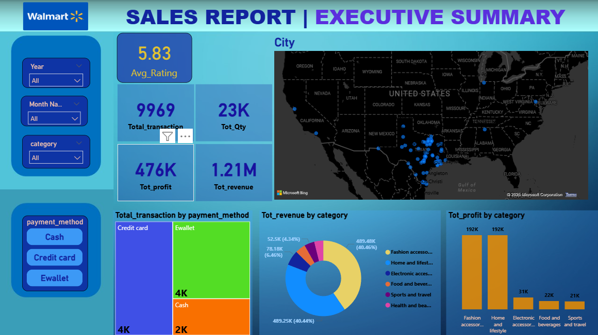
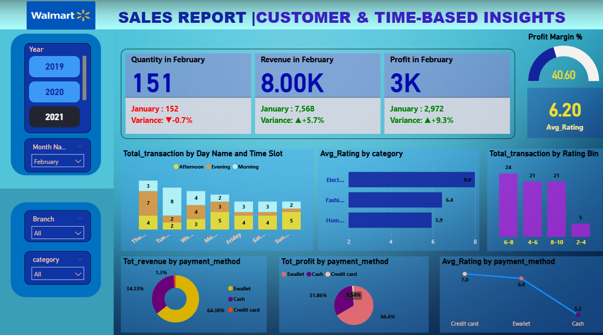
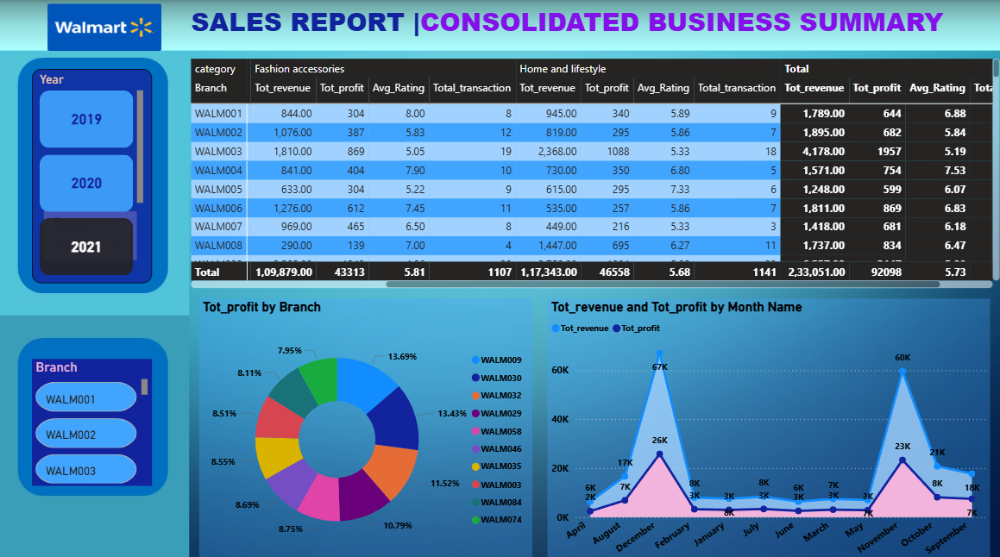

# 🛒 End-to-End Walmart Sales Analytics Project

## 📌 Project Overview
Executed a comprehensive **Walmart Sales Analytics Project** involving multiple stages of the data analytics lifecycle:
- **Exploratory Data Analysis (EDA) in Python** to uncover sales patterns and customer behavior.  
- **10 complex SQL queries** designed to solve business problems and derive actionable insights.  
- **Hypothesis testing with statistical methods (t-test)** to validate assumptions and support decision-making.  
- **Interactive 3-page Power BI dashboard** showcasing KPIs, trends, and performance metrics for strategic decision-making.  

This project demonstrates end-to-end capabilities in **data cleaning, analysis, business problem-solving, and dashboarding**.

---

## 🔍 Exploratory Data Analysis (EDA)

The EDA process was carried out in **Python** with a focus on data quality, preprocessing, and uncovering key sales insights.  

### Key Steps:
1. **Data Understanding**  
   - Explored dataset structure, dimensions, column distributions, and business context.  
   - Analyzed sales, profit, customer, and transaction-related attributes.  

2. **Missing Value Handling**  
   - Checked for missing/null values across numerical and categorical fields.  
   - Imputed or removed missing values based on relevance and business logic.  

3. **Duplicate Value Removal**  
   - Identified and dropped duplicate rows to ensure data integrity.  

4. **Data Type Optimization**  
   - Converted columns (e.g., dates, categorical fields, IDs) into appropriate formats to optimize memory usage and query performance.  

5. **Database Connectivity**  
   - Connected the cleaned dataset to **PostgreSQL** using:  
     - **SQLAlchemy** (for ORM and engine creation)  
     - **psycopg2** (for direct PostgreSQL connection and execution)  
   - Enabled seamless **storage, retrieval, and SQL-based analysis** of the dataset.  

6. **Exploratory Analysis & Visualization**  
   - Generated summary statistics, distributions, correlations, and sales trend visualizations using **Matplotlib** and **Seaborn**.  
   - Identified outliers, seasonal patterns, and product-category performance drivers.  

---

## 🗄️ SQL Business Analysis

A total of **10 business problems** were solved using **complex SQL queries** executed on the PostgreSQL database.  

### Example Insights:
- Top-performing product categories and stores by revenue.  
- Revenue breakdown across branches, cities, and customer types.  
- Sales contribution by payment methods.  
- Monthly and seasonal sales patterns.  
- Customer segmentation analysis (e.g., gender-based, member vs. non-member).  

These SQL-driven insights formed the foundation for dashboard metrics and hypothesis testing.  

---

## 📊 Power BI Dashboard

The project includes an **interactive 3-page Power BI dashboard** designed for business leaders to track **KPIs, sales patterns, and performance insights**.  

### 🔹 Page 1: Consolidated Business Summary
- Branch-wise total revenue, profit, and average ratings  
- Profit distribution across branches  
- Monthly revenue & profit trends  

---

### 🔹 Page 2: Customer & Time-Based Insights
- Monthly performance variance (Quantity, Revenue, Profit)  
- Transactions segmented by day & time slot  
- Revenue and profit by payment method  
- Customer ratings by category & payment method  

---

### 🔹 Page 3: Executive Summary
- Key KPIs: Total Transactions, Quantity, Profit, Revenue, Avg. Rating  
- Geographic sales distribution (map view)  
- Category-wise revenue & profit breakdown  
- Payment method analysis  

---

## 🧪 Hypothesis Testing

**Business Question:**  
Does the mode of payment (**Cash vs Ewallet**) have a significant impact on the **average profit margin**?

**Approach:**  
- Applied an **Independent Sample t-test** at the **95% confidence level**.  
- **Null Hypothesis (H₀):** There is no significant difference in average profit margin between Cash and Ewallet transactions.  
- **Alternate Hypothesis (H₁):** There is a significant difference in average profit margin between Cash and Ewallet transactions.  

**Results (t-test):**  
- ✅ The **t-test results** confirmed a **statistically significant difference** in the average profit margin.  
- Since **t_cal is negative**, the **mean profit margin for Cash is significantly lower than that for Ewallet**.  

**💡 Insight & Recommendation:**  
- **Cash payments** are associated with **lower profit margins** compared to **Ewallet transactions**.  
- It is recommended to **encourage Ewallet adoption** through targeted offers, discounts, or loyalty programs, as this may lead to **higher profitability per transaction**.  
